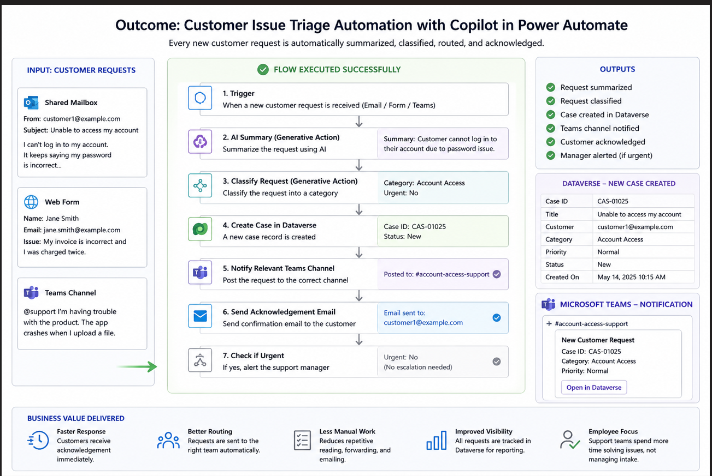

# Work Sample – Process Automation with Microsoft Power Automate

## Objective

Create an automated workflow using **Microsoft Copilot in Power Automate** to classify and route customer service requests.

---

# Scenario

A customer support team receives requests from:

- Shared mailbox
- Web form
- Microsoft Teams

The existing process is manual:

- Read each request.
- Determine the request category.
- Forward it to the correct support team.
- Update the tracking system.
- Send an acknowledgement email.

This process is repetitive, time-consuming, and prone to human error.

---

# Solution

Using Microsoft Copilot, the workflow can be created by describing the required automation in natural language.

### Copilot Prompt

> When a new customer request is received, summarize the request, classify it as billing, technical support, account access, or product feedback, create a case in Dataverse, notify the correct Teams channel, send the customer an acknowledgment email, and if the request is urgent, alert the support manager.

---

# Implementation Steps

### Step 1 – Create the Flow

Open **Power Automate** and create a new **Cloud Flow**.

Use **Copilot** to generate the workflow from the natural language prompt.

---

### Step 2 – Review the Generated Flow

Copilot automatically creates:

- Trigger for incoming customer requests
- AI-generated request summary
- Request classification
- Dataverse case creation
- Microsoft Teams notification
- Customer acknowledgement email
- Conditional branch for urgent requests

---

### Step 3 – Configure the Flow

Review and customise the generated workflow by:

- Connecting the required Microsoft services
- Updating request categories
- Selecting the correct Teams channels
- Configuring email recipients

---

### Step 4 – Test the Flow

Run the workflow using sample customer requests.

Verify that the flow:

- Correctly summarises each request
- Classifies the request accurately
- Creates a Dataverse record
- Sends notifications
- Sends acknowledgement emails
- Alerts the support manager when necessary

---

# AI Enhancement

Instead of relying on simple keyword matching, Copilot uses AI to:

- Understand natural language
- Summarise customer requests
- Determine the most appropriate category
- Decide whether escalation is required

This improves accuracy when requests are written in different ways.

---

# Business Value

This automation helps organisations to:

- Respond to customers faster
- Reduce manual effort
- Improve request routing
- Standardise customer support processes
- Reduce human error
- Improve case tracking
- Allow support staff to focus on resolving issues rather than administrative tasks

---

# Technologies Used

- Microsoft Power Automate
- Microsoft Copilot
- Microsoft Dataverse
- Microsoft Teams
- AI-powered Generative Actions

---

# Skills Demonstrated

- Workflow automation
- AI-assisted automation
- Business process optimisation
- Conditional logic
- Microsoft ecosystem integration
- Low-code development

## Workflow Preview

The screenshot below shows the Power Automate cloud flow generated with Microsoft Copilot for automatically triaging customer service requests. The workflow classifies incoming requests, creates a Dataverse case, sends Microsoft Teams notifications, and acknowledges the customer automatically.

