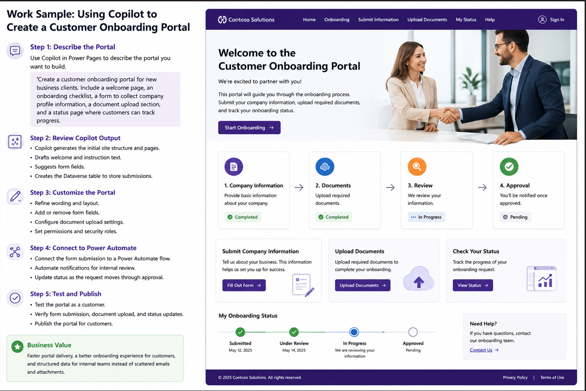

# Work Sample – Customer Onboarding Portal with Microsoft Power Pages

## Objective

Create a secure **Customer Onboarding Portal** using **Microsoft Copilot in Power Pages** to simplify the onboarding process for new business clients.

---

# Scenario

A company needs a public-facing portal where new customers can:

- Learn about the onboarding process.
- Submit company information.
- Upload required documents.
- Track the progress of their onboarding request.

Without a portal, these activities are often handled through emails and manual document collection.

---

# Solution

Using Microsoft Copilot, the website can be generated by describing the required portal in natural language.

### Copilot Prompt

> Create a customer onboarding portal for new business clients. Include a welcome page, an onboarding checklist, a form to collect company profile information, a document upload section, and a status page where customers can track progress.

---

# Implementation Steps

### Step 1 – Create the Portal

Open **Microsoft Power Pages** and create a new website using **Copilot**.

Enter the natural language prompt to generate the initial portal.

---

### Step 2 – Review the Generated Website

Copilot automatically generates:

- Welcome page
- Onboarding checklist
- Company information form
- Document upload page
- Status tracking page
- Dataverse table for storing submissions

---

### Step 3 – Customise the Portal

Review and refine the generated website by:

- Updating page text
- Adding or removing form fields
- Adjusting the page layout
- Configuring security and permissions
- Applying company branding

---

### Step 4 – Connect Business Processes

Connect the onboarding form to **Power Automate** to:

- Notify internal reviewers
- Start the approval process
- Update onboarding status automatically
- Send confirmation emails

---

### Step 5 – Test and Publish

Test the portal by submitting a sample onboarding request.

Verify that:

- Company information is saved in Dataverse.
- Documents upload successfully.
- Power Automate workflow starts correctly.
- Status updates appear on the tracking page.

Publish the portal when testing is complete.

---

# Business Value

This solution helps organisations to:

- Deliver customer portals faster.
- Improve the onboarding experience.
- Reduce manual email communication.
- Collect structured business information.
- Improve collaboration between departments.
- Automate onboarding workflows.

---

# Technologies Used

- Microsoft Power Pages
- Microsoft Copilot
- Microsoft Dataverse
- Microsoft Power Automate

---

# Skills Demonstrated

- Low-Code Website Development
- AI-assisted Website Creation
- Microsoft Dataverse Integration
- Workflow Automation
- Self-Service Portal Design
- Power Platform Integration

---

# Final Outcome

The screenshot below shows the completed customer onboarding portal generated with Microsoft Copilot in Power Pages.

